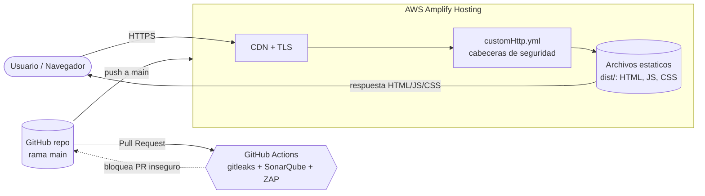

# Modelo de amenazas — Portal de Proveedores (Demo)

Modelo **STRIDE** para una web informacional **estática** (Vite + vanilla TS)
servida como archivos estáticos detrás del CDN de **AWS Amplify Hosting**. No
hay backend ni base de datos: el activo principal es el **navegador del usuario**
y la **integridad/configuración de los archivos servidos**.

> Documento educativo y **defensivo**. Sirve para razonar mitigaciones, no para
> construir ataques.

## Diagrama de flujo (data flow)

Límite de confianza principal: **navegador del usuario ↔ contenido servido**.
El segundo límite es **PR ↔ main**: el pipeline impide que código inseguro se
mezcle a `main` (y por tanto que Amplify lo despliegue).

## Tabla STRIDE

| STRIDE | Amenaza | Dónde aplica | Mitigación en este proyecto |
|--------|---------|--------------|------------------------------|
| **S — Spoofing** | Suplantar el sitio (phishing) o que el sitio redirija a un dominio atacante | Página de búsqueda con `?next=`; dominio del sitio | TLS/HTTPS gestionado por Amplify; **allowlist de redirecciones** (`lib/redirect.ts`); `Strict-Transport-Security` en `customHttp.yml` |
| **T — Tampering** | Modificar el contenido servido o inyectar HTML/JS en el DOM | Render de parámetros (`?q=`), formulario de contacto | **`textContent`** en vez de `innerHTML` (`lib/dom.ts`); **CSP** estricta (`script-src 'self'`) en `customHttp.yml`; integridad del repo vía PR + checks |
| **R — Repudiation** | Falta de trazabilidad de cambios | Repositorio / pipeline | Historial de Git, PRs revisables, logs de GitHub Actions y de despliegues de Amplify |
| **I — Information Disclosure** | Exponer secretos o datos sensibles | Bundle JS público; páginas “internas” | **Sin secretos en código** (config por `import.meta.env`); **gitleaks** en CI + hook local `block-secrets.sh`; no publicar contenido sensible en estáticos |
| **D — Denial of Service** | Saturar el sitio | CDN / hosting | Mitigado a nivel de plataforma por el **CDN de Amplify** (escala/caché); sitio 100% estático sin lógica costosa |
| **E — Elevation of Privilege** | Acceder a funciones/áreas “restringidas” | Páginas “internas” solo ocultas | Un sitio estático **no** impone control de acceso: lo sensible va detrás de un **backend autenticado**, no en estáticos (ver A01) |

## Mapeo a las vulnerabilidades del demo (rama `feature/demo-vuln`)

Cada vulnerabilidad de la rama insegura corresponde a una categoría OWASP Top 10
y a una(s) letra(s) STRIDE. En `main` están **corregidas**.

| OWASP | Vulnerabilidad (rama vuln) | STRIDE | Fix en `main` | Detectado por |
|-------|----------------------------|--------|----------------|----------------|
| **A03 – Injection / XSS DOM** | `el.innerHTML = params.get('q')` sin escapar | T (I) | `textContent` / `setText()` | SAST (SonarQube), lint, DAST (ZAP), hook `lint.sh` |
| **A02 – Cryptographic Failures** | API key/token hardcodeado en un módulo TS | I | Config por `import.meta.env`, sin secretos | gitleaks, hook `block-secrets.sh`, SAST |
| **A01 – Broken Access Control** | Página “interna” oculta solo por no enlazarla | E | No publicar lo sensible en estáticos | Revisión / threat model (no hay control real en estáticos) |
| **A10 – SSRF / Open Redirect** | `location.href = params.get('next')` sin validar | S (T) | `safeRedirect()` con allowlist | SAST, DAST, revisión |
| **A06 – Vulnerable Components** | Dependencia npm vieja con CVE (lodash 4.17.11) | T (I) | Versión parcheada / quitar dependencia | Dependabot (SCA), SAST |
| **A05 – Security Misconfiguration** | Sitio servido **sin** cabeceras de seguridad | T (S, I) | `customHttp.yml` con CSP, X-CTO, X-Frame-Options, Referrer-Policy, HSTS | DAST (ZAP marca cabeceras ausentes), revisión |

## Supuestos y límites

- El sitio no procesa datos sensibles ni autentica usuarios; es informacional.
- La seguridad de la cadena de suministro del build depende de GitHub Actions y
  npm; Dependabot reduce el riesgo de dependencias.
- Las PR **no se despliegan**: Amplify está conectado únicamente a `main`.
